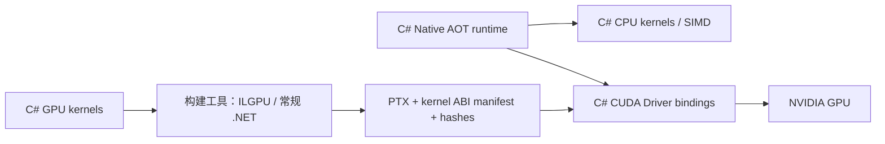

# Sezika 架构设计

状态：实现与设计并存，2026-09-23。当前库包含 bounded asset/tokenizer、固定真实 Laya/mmBERT 开发资产、CPU typed decision 实现，以及由构建期 ILGPU 产物驱动的 CUDA Driver 完整 encoder/head。模型权重不随仓库发布；多语言质量、跨平台性能和 Tomur 接入仍按阶段证据验收。阶段入口见 [ROADMAP](../ROADMAP.md)。

## 1. 目标与非目标

实现本地、多语言、非自回归的 typed decision engine：输入 state、instructions 和有限候选，输出概率分布及可拒答的类型化结果。模型管理、CPU/GPU 数值算子与推理调度均以 C# 实现，宿主以 .NET 10 Native AOT 发布。

不把开放式回答、任意 JSON 生成或工具执行器纳入决策核心。首版复用许可明确的预训练 encoder/head 权重；自有训练是独立交付，不宣称从零训练了基础模型。

## 2. 纯 C# 与 GPU 边界

“纯 C#”指本项目模型、算子及调度的源代码均使用 C#，GPU kernel 由 C# 编译生成。允许运行时调用系统/显卡驱动 API，包括 CUDA Driver；不通过 C++ bridge、ONNX Runtime、LibTorch、cuBLAS、cuDNN 或其他 native 数值库承担推理。cuBLAS/cuDNN 属于计算库，不属于驱动例外。

### 执行路径



ILGPU 用作构建期编译器。最终 AOT 运行时不引用 ILGPU 的动态编译/动态 launcher 路径。CUDA Driver 可以将 PTX 编译到当前设备并加载执行；这是驱动处理 GPU 指令，不是 .NET 运行时生成托管代码。需要避免冷启动驱动编译时可评估预生成 cubin，但其架构矩阵与构建依赖另行记录，不能默认已经解决。

不声称“原版 ILGPU 可直接 Native AOT 发布”。当前已通过最小 C# kernel → ILGPU 导出 → AOT Driver loader → RTX 4070 实卡数值结果关口，并将同一静态 PTX/ABI 产物用于完整 encoder/head；逐算子差异、性能矩阵和其他 RID 仍按 [GPU / AOT 决策](gpu-aot.md) 的边界记录。

## 3. 工程结构

当前实现包括核心类库、CPU 独立 CLI、CUDA backend 以及独立构建工具：

```text
src/Sezika/                 核心契约、加载、tokenizer、CPU 推理、后处理
src/Sezika.Cuda/            AOT 兼容 C# CUDA Driver backend
kernels/Sezika.Kernels/     C# kernel 源码（构建期引用 ILGPU）
tools/Sezika.KernelCompiler/ 构建期编译、导出 PTX、生成 ABI manifest
src/Sezika.Cli/             inspect / predict（CPU typed 决策）
tests/                     数值、资产、契约、CPU/GPU/AOT 生命周期测试
docs/                      设计、模型卡、校准与发布证据
```

`KernelCompiler` 是开发/发布工具，可运行普通 .NET JIT；不得作为 AOT 应用子进程或运行时依赖。最终 runtime 依赖图与构建工具图分离。核心 `Sezika` 库不依赖 Tomur。

## 4. 模型数据路径

1. 加载 manifest，校验 tensor/tokenizer/calibration 的版本、hash、来源、许可与大小。
2. 使用 checkpoint 对应 tokenizer 与 state 序列化规则构造每问题序列，保留所有候选 marker。
3. 拒绝超出 token/head/候选/批次预算的请求，形成有界 micro-batch。
4. 按选定 backend 执行 encoder → type embedding → decision head → marker scorer。
5. 对有效 logits 做温度缩放与 softmax；输出 Choice、Score、Boolean 与校准适用状态。
6. 根据调用方的显式策略返回 `answered` 或 `abstained`，不执行预测的动作。

第一版属于 cross-encoder：每个问题的候选与 state 会共同参与 attention，不能把 state 缓存为单一 embedding 后声称仍与原模型等价。多问题是 batch/micro-batch，实际工作量随问题数和序列长度增长。

## 5. 公共契约草案

`IDecisionEngine.Evaluate` 接收 `DecisionRequest` 与 CancellationToken，返回 `DecisionResponse`。`DecisionModelRuntime.Load` 加载固定模型包并拥有 CPU session，`Evaluate` 支持 DTO 和 UTF-8 JSON；调用方可顺序复用同一个 runtime。并发调用返回 busy；Dispose 后拒绝新请求，正在执行的有界请求结束后再释放模型和工作空间，避免清空活跃推理权重。接口为同步计算契约，宿主在有界执行队列中调用，不在库里无条件 `Task.Run`。CLI 与 facade 当前使用 CPU marker-head；CUDA typed backend 选择尚未接入这两个入口。

- `state` 支持 string/object/array，由 `JsonElement` 表示。
- `questions` 是 ID → Question 映射；ID 只用于结果对应，不自动加入模型语义。
- 类型判别固定为 `choice`、`score`、`boolean`，instructions/criteria 保留结构化 JSON。
- 核心 boolean 输出名为 `probability_true`；Jev 风格 `noul` 由可选兼容层映射。
- Choice/Score 的 `concentration` 明确定义为 `1 − H(p)/log(K)`。它是集中度，不是答案正确概率，也不冒充 Jev 未完全公开的 confidence 公式。
- Choice 只接收 2–32 候选，Score 只接收 2–10 级，避免 K=1 的集中度分母为零。Score 第 i 项对应数值 i（0 起），`score=Σ i×pᵢ`，范围 [0,K−1]；legend 与 probabilities 使用无前导零的十进制索引字符串作为相同键。
- 自有 prompt schema v1 将 Choice keys 按 `StringComparer.Ordinal` 排序后构造候选序列，消除 JSON object/调用方容器顺序的不确定性；Score 数组保留顺序。该规则进入 prompt/calibration provenance，参考对照也使用相同顺序，不能宣称与任意上游输入顺序无差异。
- JSON reader 在转换成 Dictionary 前拒绝重复 question/criteria key；否则默认映射过程可能覆盖重复属性，DTO validator 无法补救。当前 source-generated context 只提供类型元数据，完整受限 JSON reader 仍待实现。
- 校准 provenance 记录 profile 与 scope；未拟合或不匹配分别为 `uncalibrated`、`out_of_scope`。未校准结果可用于评测，但不能自动标为可执行。
- `abstained` 仍保留预测分布及其 argmax/期望值以供观察，`choice` 不代表已接受的行动；调用方必须先检查 status。未产生有效分布的执行失败走错误路径，不能伪装为拒答。
- 运行/输入失败使用带稳定 code 的 `DecisionException`，没有对应模型输出；未知类型、资产缺失、超时与取消不能返回假答案。
- 当前 DTO 只是类型定义，不自行完成语义验证；后续 validator 必须在计算前执行所有约束。

三类问题和答案使用显式静态多态与 System.Text.Json source generation，不允许任意 CLR 类型名进入 wire format。0.x 阶段记录契约变化，1.0 后按兼容性规则演进。

## 6. Backend 与性能

首版目标为 CPU 与 NVIDIA CUDA；AMD/Intel OpenCL、Vulkan、Metal 不列为已支持。ILGPU 能生成其他后端代码不等于 Sezika 已有相应 AOT loader、ABI 与发布测试。

backend 初始模式为 `cpu`、`cuda`、`auto`。显式 `cuda` 不可用时返回诊断；`auto` 允许调用前按设备与预算选择 CPU 并报告原因。请求过程中失败不得偷偷换 backend 继续执行而不记录。

权重和中间张量尽量保留设备端；GPU 路径需要 GEMM/batched GEMM、softmax/reduction、norm、RoPE、激活、embedding/gather 和 attention 等 C# kernels。第一步正确性，随后 tiling/shared memory/fusion/量化；Tensor Core 能力与性能需要单独验证。C# 代码能在 GPU 上运行，不代表能自动达到 cuBLAS/cuDNN 的吞吐。

性能比较使用同一模型、精度、输入与硬件，分开记录 driver/module 冷加载、H2D/D2H、kernel 与端到端耗时。短输入、微小 batch 或频繁搬运可能让 CPU 更快。

## 7. 资源、取消与驱动互操作

- 固定工作空间预算、模型/device 常驻预算、最大排队/并发/micro-batch；禁止 unbounded Channel 和无界形状 specialization。
- CUDA context/module/stream/event/device buffer 由 C# 明确拥有；使用 SafeHandle 或等价强所有权包装，并处理释放所需 context affinity。
- 异步 copy 的 pinned host buffer 持有到 event 完成，不能提交后立即 unpin；不能在仍有 kernel 使用时释放显存或 module。
- CancellationToken 在 CPU block、GPU dispatch/micro-batch 边界生效；已提交的 kernel 通常不能任意立即中断。保持 kernel 有界，取消后停止新提交，完成必要 fence 再回收。共享 context 不作为单请求的强杀对象。
- 只加载应用可信目录中与 build manifest/hash 匹配的 PTX；模型资产不得注入任意 GPU 程序。
- 驱动不存在、版本/PTX 不兼容、设备不支持、显存不足、launch error 和设备丢失分别诊断，GPU 故障不伪造预测结果。

## 8. 多语言与训练

精确 tokenizer、领域能力和概率校准是三个不同问题。能编码某语言只说明字符可处理，不能证明语义正确或校准有效。首批中英数据单独报告，并覆盖 code-switching、实体、否定、数字、长选项、未知/不适用输入和 prompt injection 文本。

训练实现使用 C#：第一阶段 frozen encoder + head/校准优化；完整 encoder 训练与多语言数据扩充另立实验。PyTorch 等只可用于开发数值 oracle，不成为产品运行、训练交付的隐式依赖。任何 GPU 加速训练也遵守 C# kernel 与驱动例外边界。
