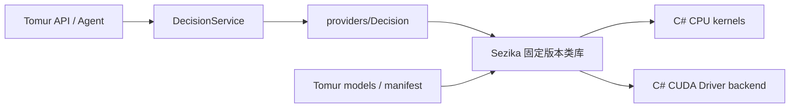

# Tomur 集成设计

状态：规划，尚未接入。Sezika 核心模型与 AOT/GPU 运行证据完成后，在 Tomur R22 落地。

## 1. 依赖方向



Tomur 继续保持单进程宿主。Sezika 是可供其他 .NET 应用使用的独立库，Tomur 只增加薄适配器；不用 HTTP 回调本机独立 Sezika 服务，不复制引擎源码，也不从任意目录动态加载程序集。

公开包具备验收证据前，可以使用固定版本的本地 NuGet feed 验证集成；正式项目不得提交依赖开发者绝对路径或兄弟目录的 ProjectReference。主程序静态引用 `providers/Decision`，后者引用固定 Sezika 包及按构建选入的 CUDA backend。

## 2. 能力与模型资产

- 新 provider ID 为 `managed-decision`，按能力命名；CPU/GPU 是执行 backend，不能把 CUDA 驱动可见等同于模型可推理。
- 模型 capability 增加 `decision`；当前 Tomur capability 是字符串集合，不需要改造成大型统一模型枚举。
- 增加独立 `IDecisionProvider` / session 契约，不继承文本生成接口，不把 Choice 返回为虚构 chat completion。
- Catalog 明确 task、架构、来源 revision、许可、hash、tokenizer、head、schema 与校准文件。缺少必需资产不能标为可用；校准未完成与文件损坏使用不同状态。
- 权重由 `<data>/models` 管理，复用 pull、checksum、proxy、license 提示与安装清单。GPU kernel 属于可信程序发布资产，不由模型包提供任意 PTX。
- 首个模型包注册必须等待具体 revision/许可审计；研究时不向默认 Catalog 添加无法运行的条目。

## 3. 拟议 API

| 入口 | 行为 |
| --- | --- |
| `GET /api/decisions/status` | provider、CPU/GPU、资产、session、校准范围与验证状态 |
| `POST /api/decisions` | bounded state/questions → typed answers，返回模型 revision/backend/calibration |
| `POST /v1/systemone`（后续可选） | Jev 风格 Choice/Score/Noul 映射；仅通过明确协议矩阵后提供 |

拟议原生请求：

```json
{
  "model": "<installed-decision-model-id>",
  "state": { "message": "发票重复扣款，请帮我核对。" },
  "questions": {
    "intent": {
      "type": "choice",
      "instructions": "选择最合适的处理类别。",
      "criteria": {
        "billing": "扣款、发票或退款",
        "technical": "软件故障",
        "other": "不属于以上类别"
      }
    }
  }
}
```

这只是请求形状示例，不对应已发布模型或真实推理输出。结果保持 Sezika typed schema，独立于 chat streaming。缺模型返回 `decision_model_not_installed`，未知架构返回 `decision_architecture_unsupported`，超预算返回 `decision_input_limit_exceeded`，显式 CUDA 不可用返回 `decision_backend_unavailable`；HTTP 状态和错误 envelope 在 R22 P0 冻结。

兼容层需要逐项对齐 state/instructions/criteria 结构、question ID、Score legend、Noul、usage、错误与上限。Sezika 初始候选/上下文限制小于 Jev，不承诺 255 候选或 64k。概率与 `confidence` 语义必须明确；不能将 entropy concentration 直接当作与 Jev 相同的校准/正确率承诺。

## 4. Tomur 代码落点

| 位置 | 计划变更 |
| --- | --- |
| `providers/Abstractions/DecisionContracts.cs`（新增） | 宿主侧窄决策能力与 session 契约 |
| `providers/Decision/`（新增） | Sezika 适配器与固定包引用；不承载 HTTP/服务 |
| `app/Tomur.csproj`、`Tomur.slnx` | 静态引用 provider；AOT 与非 AOT provider 集合明确 |
| `app/Providers/ModelProviderRegistry.cs` | 独立 decision provider 注册、选择与状态 |
| `app/Models/ModelCatalog.cs` | 经审计的 decision 模型包 |
| `app/Runtime/LocalModelCatalog.cs` | 识别 decision capability，避免默认归类为 chat |
| `app/Decisions/DecisionService.cs`（新增） | session、总内存/显存预算、排队、取消和卸载 |
| `app/Api/DecisionRouteExtensions.cs`（新增） | 原生 API、输入限制与身份校验 |
| `app/Api/ApiRouteExtensions.cs`、`app/Cli/ServeCommand.cs` | 注册路由和依赖 |
| `app/Serialization/AppJsonSerializerContext.cs` | 静态 JSON 类型注册与 AOT 序列化 |
| `app/Agents/ToolFactory.cs`、`ToolInvoker.cs` | `decision.predict` 只读工具与现有确认机制联动 |
| `app/Native/` 或专用 driver interop 子目录 | 如宿主需要设备诊断，保持驱动互操作边界明确；不加入 native 数值实现 |

上述是设计落点，不代表文件或实现均已存在。新 provider 不复用 `ManagedGlmProvider` 的因果 decoder/KV-cache 假设，也不把上游项目名作为 provider ID。

## 5. 身份、资源与工具边界

只读检查发现 ApiKeyStore 已存在，但没有确认普通 HTTP API 已有完整统一鉴权中间件。因此新入口必须显式检查实际宿主监听/身份策略，不能宣称“天然继承 API-key 保护”；不得引入新的匿名远程入口。

Tomur 使用 `InvariantGlobalization=true`。必须在实际 AOT 发布物中验证多语言 tokenizer 的 Unicode/normalization、序列化与 culture-independent 行为，不能仅靠非 AOT 单测通过。

与 Chat/Realtime 共用宿主资源时，显式制定 CPU 并发、显存常驻、load/unload、repair、优先级与取消 fence。GPU kernel 完成前不得释放显存；取消不意味着已提交的 kernel 可以立刻终止。

`decision.predict` 不具备副作用。后续路由建议进入 Tomur 原有 allowlist、参数校验和一次性精确确认；高 confidence、`act_probability` 或模型选中了某个工具都不是授权。低质量/未校准模型默认只用于显式评测和提示，不自动接管 Chat 路由。

## 6. 状态与验收

分别报告：`provider_built_in`、`driver_available`、`assets_verified`、`schema_valid`、`session_loaded`、`prediction_completed/abstained`、`calibration_status`、`multilingual_quality_verified`、`aot_smoke_verified`、`latency_verified`。

顺序验收：

1. 已审计模型经 Tomur pull 安装、校验并由 Sezika 正确加载。
2. 中英的 Choice/Score/Boolean 请求经同进程链路得到真实模型结果，与独立 Sezika 结果对齐。
3. 缺模型、错误架构、非法 schema、超限、取消、队列满、显存不足、卸载竞态和鉴权失败都返回稳定诊断。
4. 既有 chat/Agent/Realtime 功能及工具确认边界不被绕过。
5. CPU 与 CUDA 各自取得真实模型和 Native AOT 运行证据；协议通过、多语质量、校准、延迟、资源回收各有独立记录。

本次没有修改 Tomur 运行代码、下载模型、执行构建测试或真实 smoke。
